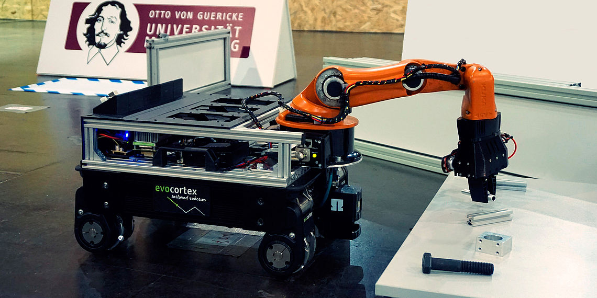
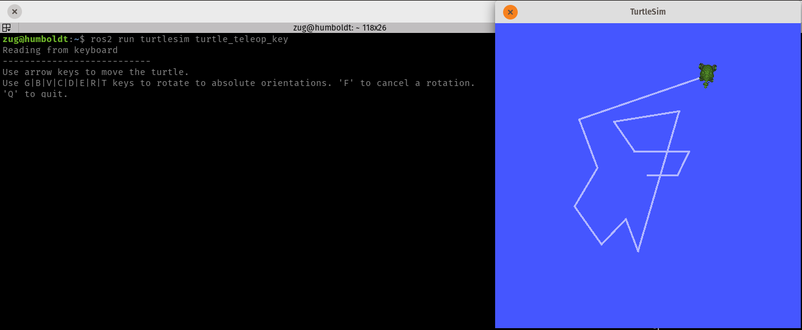
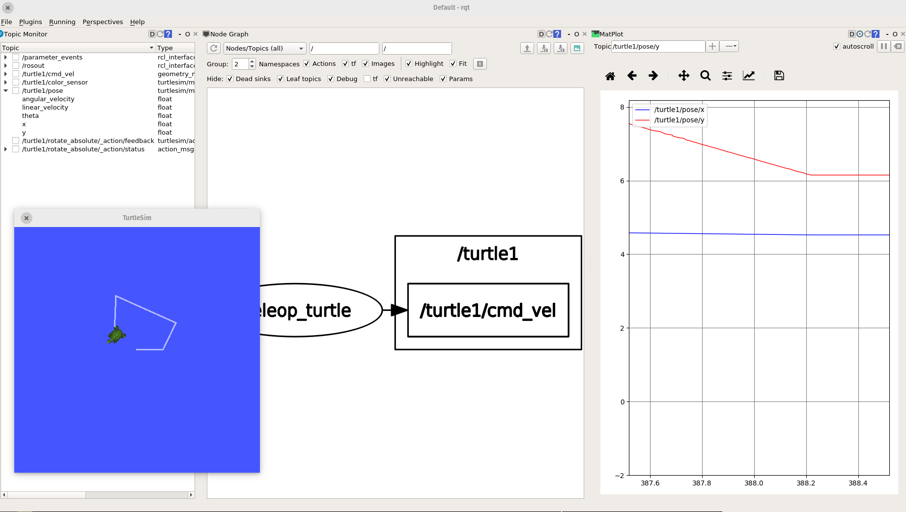

<!--
author:   Sebastian Zug

email:    sebastian.zug@informatik.tu-freiberg.de

version:  0.0.1

language: en

comment:  "I don't git it" Einführung in die Grundlagen der Versionsverwaltung 

import: https://github.com/liascript/CodeRunner
        https://raw.githubusercontent.com/liaTemplates/ExplainGit/master/README.md
        https://raw.githubusercontent.com/liascript-templates/plantUML/master/README.md

narrator: DE

-->

[](https://liascript.github.io/course/?https://raw.githubusercontent.com/SebastianZug/RoboLabVortraege/main/09_ROS_1/presentation.md#1)

# TUBAF Bits&Bytes

----------------------------------------------------------------

Donnerstag, 25.04.2024, 17 Uhr, RoboLab der TU Bergakademie Freiberg

---------------------

Prof. Dr. Sebastian Zug

> _Im nunmehr schon 9. und 10. Bits&Bytes-Vortrag stellt diese und nächste Woche Prof. Dr. Sebastian Zug die generellen Konzepte von Programmierframeworks für autonome Systeme dar und führt darauf aufbauend in die Nutzung des "Robot Operating Systems" (ROS) ein. Dabei werden grundlegende Kommunikationskonzepte und Abstraktionen besprochen, um diese dann anhand von kleinen Projekten praktisch greifbar zu machen._

## Frameworks um Roboter zu programmieren - Warum?

                                   {{0-1}}
********************************************************************************

**Welche Herausforderungen stecken in der Programmierung eines Roboters?**



********************************************************************************


                                  {{1-2}}
********************************************************************************


********************************************************************************


### Vergleich von Frameworks

                                  {{0-1}}
********************************************************************************

1. Hardwareunterstützung und Laufzeitumgebung

+ **Betriebssystem** Eine Robotikentwicklungsumgebung sollte mehrere Betriebssysteme und dabei eine möglichst umfangreiche Abdeckung für häufig genutzte Bibliotheken, Komponenten oder Hardwaretreiber bieten.

+ **Unterstützung ressourcenbeschränkter Systeme** Die Interaktion und Kooperation mit ressourcenbeschränkten Systemen ist u.a. in Bereichen gefragt, in denen z.B. die Effizienz und Kosten der eingesetzten Komponenten eine tragende Rolle spielen. Für ein breites Anwendungsspektrum des jeweiligen Frameworks ist eine entsprechende Unterstützung solcher Systeme wünschenswert.

+ **Echtzeitfähigkeit** Robotikanwendungen umfassen häufig Anwendungselemente, die harte Echtzeitanforderungen an die Verarbeitung stellen. Regelschleifen zur Ansteuerung von Manipulatoren benötigen, um stabil zu laufen, ein deterministisches Zeitverhalten.

+ **Treiberintegration** Ein Framework sollte nicht nur eine die Vielfalt an Sensoren und Aktoren, sondern auch konkrete Robotersysteme spezifischer Hersteller, die auf diesen Komponenten aufsetzen, unterstützen.

********************************************************************************

                                  {{1-2}}
********************************************************************************

2. Kommunikation

+ **Kommunikationsmiddleware** Damit Anwendungen verteilt über mehrere Rechnerknoten laufen können und somit eine Ortsunabhängigkeit gewährleisten, sind entsprechende Mechanismen erforderlich.

+ **Kommunikationsparadigmen** Im Kontext einer Anwendung ist die Abdeckung unterschiedlicher Formen für den Nachrichtenaustausch zwischen den Komponenten wünschenswert. Als Interaktionsmuster sind die *Client-Server-Beziehung* und das *Publish-Subscribe-Modell* denkbar.

+ **Echtzeitfähigkeit** Anknüpfend an die Echtzeitfähigkeit der Laufzeitumgebung ist das deterministische Verhalten der Kommunikationsverbindungen Voraussetzung für die Entwicklung zeitkritischer Systeme.

********************************************************************************

                                  {{2-3}}
********************************************************************************

3. Programmierung

+ **Unterstützte Programmiersprachen**  Bei der Anwendungsentwicklung sollte dem Entwickler möglichst die Wahl gelassen werden, in welcher Programmiersprache entwickelt wird. Eine domain-spezifische Frage zielt dabei auf die Möglichkeit der grafischen Programmierung.

+ **Unterstützungsbibliotheken** Vordefinierte Komponenten z.B. für Pfadplanung, Verhaltensauswahl und Lokalisierung erleichtern den Entwicklungsprozess und fördern die Wiederverwendung von Software-Modulen, wobei gegebenenfalls entsprechende Anpassungen erforderlich sind.

+ **Erweiterbarkeit** Erweiterbarkeit bedeutet hier die Unterstützung für das Hinzufügen neuer Software-Module und neuer Hardware-Komponenten in das bestehende Rahmenwerk.

+ **Lizenzmodell** Der Typ der Lizenz der Frameworks bestimmt insbesondere im Fall der kommerziellen Nutzung über deren generelle Anwendbarkeit. Durch das gewählte Lizenzmodell wird die Breite der Entwicklungs-Community zumindest mitbestimmt. Eine aktive Community erleichtert die Entwicklungsarbeit und bieten in Wikis oder Foren eine Vielzahl von Antworten, Anregungen und Beispielcode.

********************************************************************************

                                  {{3-4}}
********************************************************************************

4. Test und Debugging

+ **Monitoring** Die Überwachung der einzelnen Komponenten und deren Beziehungen zueinander muss in einem übergreifenden Ansatz möglich sein, um komfortabel Aussagen über den Status des Robotersystemes. Eine grafische Schnittstelle, die die Visualisierung einzelner Komponenten, des Gesamtsystems oder einzelner Parameter übernimmt, vereinfacht die Entwicklung erheblich.

+ **Logging** Das Logging der Anwendungsoperation unterstützt einerseits das Debugging und ermöglicht andererseits eine Wiederholung dieser Anwendungsausführung im Sinne eines Wiederabspielens einer Aufzeichnung. Somit wird eine Offline-Analyse der implementierten Funktionalitäten möglich, sodass auch Aussagen über die Performance dieser bzw. des Gesamtsystems getroffen werden können.

+ **Simulation** Die Simulation der realen Welt ermöglicht es den Entwicklern, ihre Anwendungen zu testen, ohne die entsprechende Hardware besitzen zu müssen, indem diese geeignet modelliert wird. Die Simulatoren können dabei in Form von „einfachen“ zweidimensionalen bis hin zu komplexen 3-D-Umsetzungen mit realistischen physikalischen Gegebenheiten vorliegen.


********************************************************************************

## ROS, was ist das?

                                  {{0-1}}
********************************************************************************

> Robot Operating System (ROS) ist ein Framework für die Entwicklung von Robotern. Dabei ist ROS kein Betriebssystem sondern eine Middleware mit aufgesetzter Paketstruktur. 2023 listeten die Statistiken mehrere tausend Repositories und Pakete. ROS wird unter der BSD-Lizenz veröffentlicht und ist somit der Open-Source-Szene zuzuordnen.

Die Hauptbestandteile und -aufgaben von ROS sind:

+ Hardwareabstraktion
+ Gerätetreiber
+ oft wiederverwendete Funktionalität
+ Nachrichtenaustausch zwischen Programmen bzw. Programmteilen
+ Paketverwaltung
+ Programmbibliotheken zum Verwalten und Betreiben der Software auf mehreren Computern

Die Webseite von ROS findet sich unter [ROS](https://www.ros.org/).

********************************************************************************

                                  {{1-2}}
********************************************************************************

Die Entwicklung begann 2007 am Stanford Artificial Intelligence Laboratory im Rahmen des Stanford-AI-Robot-Projektes (STAIR) und wurde ab 2009 hauptsächlich am Robotikinstitut Willow Garage weiterentwickelt. Seit April 2012 wird ROS von der neu gegründeten, gemeinnützigen Organisation Open Source Robotics Foundation (OSRF) unterstützt und seit Beendigung der operativen Tätigkeit von Willow Garage 2013 von dieser koordiniert, gepflegt und weiterentwickelt.

Das erste Paper, in dem die Basiskonzepte beschrieben wurden, ist unter [Link](http://www.robotics.stanford.edu/~ang/papers/icraoss09-ROS.pdf) zu finden.

> Seit Beginn der Entwicklung von ROS 2.0 wird zwischen ROS 1 und ROS 2 unterschieden. Die beiden Hauptversionen sind nicht miteinander kompatibel, jedoch interoperabel und können parallel ausgeführt werden.

Die aktuellen Versionen sind

+ ROS1 - _Noetic Ninjemys_ (Noetische Ninjemys Oweni) veröffentlicht im Mai 2020 und
+ ROS2 - _Humble Hawksbill_ (bescheidene Echte Karettschildkröte) Veröffentlichung im Mai 2021 (LTS Version).
+ ROS2 - _Iron Irwini_ (eiserne Irwins Schildkröte) Veröffentlichung im Mai 2023.

********************************************************************************

###  ROS 1 vs. ROS 2

| Merkmal                     | ROS1                                                                                     | ROS2                                                                                                                                                                             |
|:----------------------------|:-----------------------------------------------------------------------------------------|:---------------------------------------------------------------------------------------------------------------------------------------------------------------------------------|
| Betriebssysteme             | Linux (Ubuntu, Gentoo, Debian), OS X                                                     | Linux  (Ubuntu), OS X, Windows 10                                                                                                                                                |
| Programmiersprachen C       | C++03                                                                                    | C++11 (einzelne Konzepte von C++14)                                                                                                                                              |
| Programmiersprachen Python  | Python 2                                                                                 | Python 3.5                                                                                                                                                                       |
| Middleware                  | eigene Konzepte für den Datenaustausch                                                   | abstraktes Middlewarekonzept offen für spezifische Lösungen (aktuell DDS als Default-Implementierung), mit einem geeigneten Middleware-Ansatz sind Echtzeitanwendungen umsetzbar |
| Build System                | [CMake](https://cmake.org/) Projekte mit [catkin](https://docs.ros.org/api/catkin/html/) | CMake Projekte (mit colcon), andere Systeme können integriert werden                                                                                                             |
| Paketstruktur               | Integrierende Pakete möglich                                                             | aus Gründen der automatisierten Auflösung von Abhängigkeiten nur isolierte Pakete                                                                                                |
| Message/Service Deklaration | Messageformatdefinitionen auf der Basis von Grundtypen,                                  | einheitliche Namen in Python und C++, default Werte, separate Namespaces für Services und Messages, einheitliche Zeittypen für die APIs                                          |
| Systemkonfiguration         | XML Beschreibungen                                                                       | Python Code für den Systemstart mit komplexen Logiken                                                                                                                            |
| Node vs. Nodelet            | unterschiedliche APIs für beide Konzepte                                                 | Implementierungen zielen auf eine Shared Library - es wird zur Laufzeit entschieden, ob diese als separater Prozess oder innerhalb eines Prozesses ausgeführt wird.              |

Einen Überblick zu den genannten Features gibt die Webseite [Link](http://design.ros2.org/articles/changes.html)


> Neue Projekte sollten immer auf ROS2 aufsetzen!

Falls es Probleme bei der Umsetzung einzelner Pakete gibt, bietet das Paket `ros1_bridge` Hilfe, das die Kommunikation zwischen einem ROS1 und einen ROS2 Graphen sicherstellt.

### Wie kann man sich in ROS einarbeiten?

                                 {{0-4}}
*******************************************************************************

1. Das offizielle ROS-Tutorial-Website ist sehr umfangreich und in mehreren Sprachen verfügbar. Es enthält Details zur ROS-Installation, Dokumentation von ROS, etc. und ist völlig kostenlos.  Dabei lauern aber einige Fallstricke:

   * Achten Sie immer, wenn Sie sich in ein Beispiel einlesen auf die zugehörige ROS-Versionsnummer!
   * Prüfen Sie Abhängigkeiten und die Aktualität der Bibliotheken.
   * Informieren Sie sich darüber in wie weit an dem Paket aktuell noch gearbeitet wird. Letzte Commits vor einigen Monaten sind immer ein schlechtes Zeichen :-)

| ROS2                                                | ROS1                               | Hintergrund                  |
|:----------------------------------------------------|:-----------------------------------|:-----------------------------|
| https://index.ros.org/doc/ros2/                     | http://wiki.ros.org/               | Hauptseite des Projektes OSF |
| https://discourse.ros.org/                          | https://answers.ros.org/questions/ | ROS Forum                    |
| https://index.ros.org/doc/ros2/Tutorials/#tutorials | http://wiki.ros.org/ROS/Tutorials  | ROS Tutorials                |

*******************************************************************************

                                 {{1-4}}
*******************************************************************************

2. Es existiert eine Vielzahl von Tutorials in Form von Videos, die einen Überblick versprechen oder einzelne Themen individuell adressieren.

<!-- data-type="none" -->
| Titel                    | Inhalt                                                              | Link                                                                                        |
|:-------------------------|:--------------------------------------------------------------------|:--------------------------------------------------------------------------------------------|
| ROS tutorial #1          | Installation, erste Schritte                                        | [Link](https://www.youtube.com/watch?v=9U6GDonGFHw&t=72s)                                   |
| Programming for Robotics | 5 Kurse als Einführung in ROS1 der ETH Zürich                       | [Link](https://www.youtube.com/watch?v=0BxVPCInS3M&list=PLE-BQwvVGf8HOvwXPgtDfWoxd4Cc6ghiP) |
| ROS2 Tutorials           | Tutorial des kommerziell orientierten Kursanbieters "The Construct" | [Link](https://www.youtube.com/playlist?list=PLK0b4e05LnzYNBzqXNm9vFD9YXWp6honJ)            |

*******************************************************************************

                                 {{2-4}}
*******************************************************************************

3. Verschiedene Hochschulen und Institutionen bieten Kurse und Summer Schools an. Achtung, diese sind teilweise kostenpflichtig!

*******************************************************************************

                                 {{3-4}}
*******************************************************************************

4. Zu empfehlen ist das Buch von Newmann "A Systematic Approach to Learning Robot Programming with ROS" oder aber von Kane "A Gentle Introduction to ROS". Letzteres ist online unter [Link](https://cse.sc.edu/~jokane/agitr/agitr-letter.pdf) zu finden. Beide beziehen sich aber auf ROS 1.

*******************************************************************************

## Basiskonzepte

                        {{0-1}}
***********************************************************

> ROS definiert 3 Basis-Konzepte für die Kommunikation:
>
> - Publish-Subscribe 
> - Services
> - Actions

In der heutigen Veranstaltung fokussieren wir uns auf das Publish-Subscribe-Modell.

***********************************************************
                        
                        
                        {{1-2}}
***********************************************************

**Pakete** - Pakete kapseln einzelne Algorithmen und realisieren deren Abhängigkeiten. Letztendlich wird damit die Wiederverwendbarkeit einer Implementierung gewährleistet.

https://fkromer.github.io/awesome-ros2/

**Node** - Ein Knoten ist Teilnehmer im ROS-Graphen. ROS-Knoten verwenden eine ROS-Clientbibliothek, um mit anderen Knoten zu kommunizieren. Knoten können ein *Subject* veröffentlichen oder abonnieren. *Nodes* können auch einen Dienst bereitstellen oder verwenden. Einem Knoten sind konfigurierbare Parameter zugeordnet. Verbindungen zwischen Knoten werden durch einen verteilten Erkennungsprozess hergestellt. Knoten können sich im selben Prozess, in unterschiedlichen Prozessen oder auf unterschiedlichen Rechnern befinden.

**Messages** - To enable the communication of data packets between the nodes, their structure and content format must be specified. Which data formats are used, where is the sending sensor located, which units of measurement represent the information? ROS defines abstract message types for this purpose.


**Discovery** - Die Erkennung von *Nodes* erfolgt automatisch über die zugrunde liegende Middleware von ROS2. 

**Topics** - Topics repräsentieren den Inhalt einer Nachricht und erlauben damit die Entkopplung von Informationsquelle und Informationssenke. Die Knoten brauchen nicht zu wissen, mit wem sie kommunizieren, allein das "Label" oder "Thema" genügt.  

**Messages** - Um die Kommunikation von Datenpaketen zwischen den Knoten zu ermöglichen, muss deren Aufbau und inhaltliches Format spezifiziert werden. Welche Datenformate werden verwendet, wo befindet sich der versendende Sensor, welche Maßeinheiten bilden die Informationen ab? ROS definiert dafür abstrakte Message-Typen.

***************************************************

                  {{2-3}}
**************************************************

<!--
style="width: 80%; max-width: 860px; display: block; margin-left: auto; margin-right: auto;"
-->
```ascii

Publisher "dist"                             Subscriber "dist"

+------------+       .---------------.       +------------+
| Node 1     | ----> | Message       | ----> | Node 2     |
+------------+       |  Float32 data |       +------------+
                     |  Int     type |
                     .---------------.
 Distance sensor                             Speed control
```

Die ROS2 Message-Spezifikation integriert verschiedene Konfigurationsmöglichkeiten. Auf der obersten Ebene sind dies einfache Namens- und Typzuweisungen. Dabei wird zwischen sogenannten Built-in Typen und nutzerspezifischen Typen unterschieden. Feldnamen müssen klein geschriebene alphanumerische Zeichen mit Unterstrichen zur Trennung von Wörtern sein. Die Typdefinitionen der Basistypen erfolgen anhand "C++ naher" Bezeichner (`bool`, `char`, `float32` usw. )

Komplexe Typen werden wie folgt spezifiziert

<!-- data-type="none" -->
| Index | ROS2 msg Type           | C++                |
|:------|:------------------------|:-------------------|
| 0     | zB. `float32`           | `float`            |
| 1     | `string`                | `std::string`      |
| 2     | static array            | `std::array<T, N>` |
| 3     | unbounded dynamic array | `std::vector<T>`   |
| 4     | bounded dynamic array   | custom_class<T,N>  |
| 5     | bounded string          | `std::string`      |


Im folgenden sollen Beispiele die

```
# Basic format: fieldtype1 fieldname1
# Type 0, 1 examples:
int32 my_int
string my_string

# Type 2
int32[5] five_integers_array
# Type 3
int32[] unbounded_integer_array
# Type 4
int32[<=5] up_to_five_integers_array

# Type 5
string<=10 up_to_ten_characters_string
string[<=5] up_to_five_unbounded_strings
string<=10[] unbounded_array_of_string_up_to_ten_characters each
string<=10[<=5] up_to_five_strings_up_to_ten_characters_each
```

**************************************************

## Einführungsbeispiele

**Arbeit auf der Konsole**

Die Exploration und Untersuchung eines ROS2 Systems erfolgt mittels des Tools "ros2". Mit diesem können die folgenden Konzepte adressiert werden. Dazu bietet das Tool folgendende API:

```
>ros2
usage: ros2 [-h] Call `ros2 <command> -h` for more detailed usage. ...

options:
  -h, --help            show this help message and exit
  --use-python-default-buffering
                        Do not force line buffering in stdout and instead use
                        the python default buffering, which might be affected
                        by PYTHONUNBUFFERED/-u and depends on whatever stdout
                        is interactive or not

Commands:
  action     Various action related sub-commands
  bag        Various rosbag related sub-commands
  component  Various component related sub-commands
  daemon     Various daemon related sub-commands
  doctor     Check ROS setup and other potential issues
  interface  Show information about ROS interfaces
  launch     Run a launch file
  lifecycle  Various lifecycle related sub-commands
  multicast  Various multicast related sub-commands
  node       Various node related sub-commands
  param      Various param related sub-commands
  pkg        Various package related sub-commands
  run        Run a package specific executable
  security   Various security related sub-commands
  service    Various service related sub-commands
  topic      Various topic related sub-commands
  wtf        Use `wtf` as alias to `doctor`

  Call `ros2 <command> -h` for more detailed usage.
```


### Hello-World Implementierung

Wir versuchen das "Hello World"-Beispiel der ROS Community nachzuvollziehen, dass
zwei einfache Knoten - "minimal publisher" und "minimal subscriber" - definiert.

<!--
style="width: 90%; max-width: 860px; display: block; margin-left: auto; margin-right: auto;"
-->
```ascii

Publisher für topic                                  Subscriber für topic

+-------------------+       .---------------.       +--------------------+
| minimal_publisher | ----> | Message       | ----> | minimal_subscriber |
+-------------------+       |  string  data |       +--------------------+
                            .---------------.
```

Eine entsprechende Kommentierung eines ähnlichen Codes findet sich auf der ROS2 [Webseite](https://index.ros.org/doc/ros2/Tutorials/Writing-A-Simple-Cpp-Publisher-And-Subscriber/).

```python    Publisher.py
import rclpy
from rclpy.node import Node

from std_msgs.msg import String


class MinimalPublisher(Node):

    def __init__(self):
        super().__init__('minimal_publisher')
        self.publisher_ = self.create_publisher(String, 'topic', 10)
        timer_period = 0.5  # seconds
        self.timer = self.create_timer(timer_period, self.timer_callback)
        self.i = 0

    def timer_callback(self):
        msg = String()
        msg.data = 'Hello World: %d' % self.i
        self.publisher_.publish(msg)
        self.get_logger().info('Publishing: "%s"' % msg.data)
        self.i += 1


def main(args=None):
    rclpy.init(args=args)

    minimal_publisher = MinimalPublisher()

    rclpy.spin(minimal_publisher)

    # Destroy the node explicitly
    # (optional - otherwise it will be done automatically
    # when the garbage collector destroys the node object)
    minimal_publisher.destroy_node()
    rclpy.shutdown()


if __name__ == '__main__':
    main()
```

```python    Subscriber.py
import rclpy
from rclpy.node import Node

from std_msgs.msg import String


class MinimalSubscriber(Node):

    def __init__(self):
        super().__init__('minimal_subscriber')
        self.subscription = self.create_subscription(
            String,
            'topic',
            self.listener_callback,
            10)
        self.subscription  # prevent unused variable warning

    def listener_callback(self, msg):
        self.get_logger().info('I heard: "%s"' % msg.data)


def main(args=None):
    rclpy.init(args=args)

    minimal_subscriber = MinimalSubscriber()

    rclpy.spin(minimal_subscriber)

    # Destroy the node explicitly
    # (optional - otherwise it will be done automatically
    # when the garbage collector destroys the node object)
    minimal_subscriber.destroy_node()
    rclpy.shutdown()


if __name__ == '__main__':
    main()
```

Ok, wie lassen sich diese beiden Knoten nun starten. In dieser Veranstaltung
wollen wir uns allein auf die vorinstallierten Beispiele, in diesem Fall die Pakete `examples_rclcppp_minimal_subscriber` und `examples_rclcppp_minimal_publisher` konzentrieren. Dazu
starten wir diese jeweils mit

```
#ros2 run <package_name> <node>
ros2 run examples_rclpy_minimal_subscriber subscriber_member_function
ros2 run examples_rclpy_minimal_publisher publisher_member_function
```

Lassen Sie uns diese Konfiguration systematisch untersuchen:

1. Welche Nachrichten werden in unserem bescheidenen ROS2 System ausgetauscht?

```
>ros2 topic list
/parameter_events
/rosout
/topic
>ros2 topic info /topic
Topic: /topic
Publisher count: 1
Subscriber count: 1
>ros2 topic hz /topic
average rate: 2.011
   min: 0.489s max: 0.500s std dev: 0.00474s window: 4
...
```

2. Wie lassen sich mehrere Instanzen ein und des selben Knoten integrieren?

Es soll nochmals darauf hingewiesen werden, `topic` ist ein willkürlich gewählter Name für unseren Kanal. Um beim Testen von verschiedenen Nodes eine schnelle Umbennenung zu ermöglichen können wir mittels Remapping die Topic und Nodenamen anpassen.

```
> ros2 run examples_rclpy_minimal_publisher subscriber_member_function
```

```
>ros2 topic info /topic
Topic: /topic
Publisher count: 1
Subscriber count: 2
```


Natürlich können Sie auch den Topic-Namen aus der Kommandozeile anpassen. Damit entsteht ein neuer Kanal, der keine Subcriber hat.

```
> ros2 run examples_rclcpp_minimal_publisher publisher_member_function --ros-args --remap /topic:=/topic2
```


4. Kann ich auch einen Publisher in der Konsole erzeugen?

Natürlich, dies ist ein wichtiges Element des Debugging. Starten Sie also zum Beispiel den Subscriber mit den bereits bekannten Kommandos und führen Sie dann in einer anderen Konsole den nachfolgenden Befehl aus.

```
ros2 topic pub /topic std_msgs/String  "data: Glück Auf" -n TUBAF
```

Informieren Sie sich zudem über die weiteren Parameter von `ros2 topic pub`. Sie können die Taktrate und die Qualitätskritieren der Übertragung definieren.

### Turtlebot

Das "turtlebot" Beispiel soll die verschiedenen Mechanismen der Kommunikation unter ROS verdeutlichen. Dabei wird unter anderem eine Publish-Subscribe Kommunikation zwischen einem Node für die Nutzereingaben und einer grafischen Ausgabe realisiert.

```
ros2 run turtlesim turtle_teleop_key
ros2 run turtlesim turtlesim_node
```



Wir wollen wiederum das System inspizieren und nutzen dafür ein grafisches Inspektionssystem, das in ROS2 integriert ist. Hier werden die Methoden, die `ros2` auf der Kommandozeile bereithält in einer GUI abgebildet.

```
rqt
```



### Laserscanner

Ein weiteres Beispiel ist der Laserscanner, der in der Robotik häufig eingesetzt wird. Hierbei wird ein Laserscanner auf einem Roboter montiert, um die Umgebung zu erkunden. Der Laserscanner sendet dabei einen Laserstrahl aus und misst die Zeit, die der Strahl benötigt, um zum Sensor zurückzukehren. Aus dieser Zeit kann die Entfernung zu einem Objekt berechnet werden.

```
 ros2 run urg_node urg_node_driver --ros-args --params-file ./09_ROS_I/examples/hokuyo.yml
```
